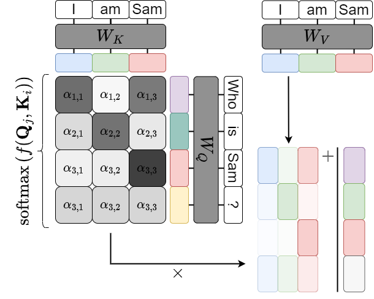

# Attention and Transformers

<p align="center">

</p>

A presentation on attention and transformers for the 2023 edition University of Amsterdam course 'Advanced Topics in Computational Semantics'. Includes the presentation and notebooks to generate some of the needed figures.

```text
attention_and_transformers/
├── attention_and_transformers.pdf
│   the actual presentation, in PDF format
├── bpe.ipynb
│   a notebook implementing Byte-Pair Encodings
├── kernel_regression.ipynb
│   a notebook with Nadaraya-Watson regression as attention
├── learning_rate.ipynb
│   a notebook visualizing linear warmup + cosine annealing
├── positional_encoding.ipynb
│   a notebook visualizing sine-cosine positional encodings
├── figures/
│   ├── *.drawio
│   │   files for drawio diagrams
│   └── *.png/pdf
└── README.md
```