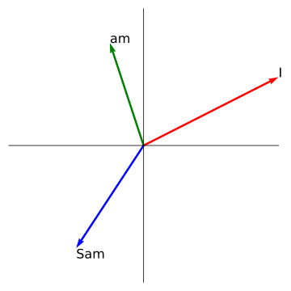
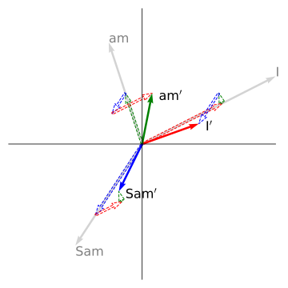
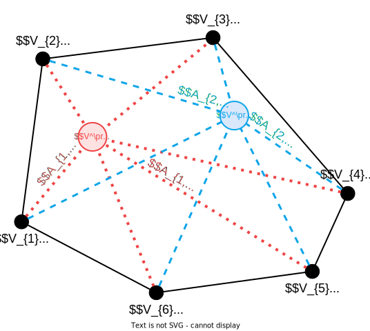
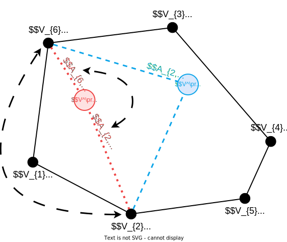
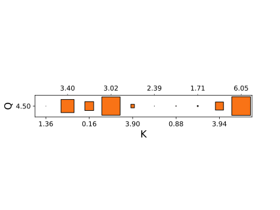
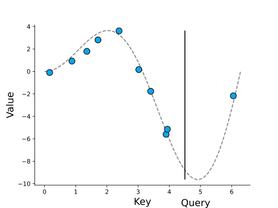
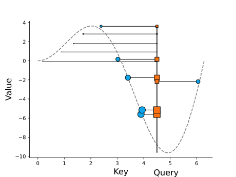
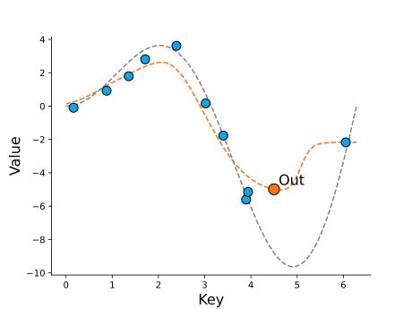
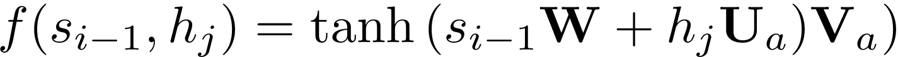

---
# You can also start simply with 'default'
theme: neversink
neversink_slug: "Attention & Transformers"
author: Ivo Verhoeven

# Export settings
exportFilename: "attention_and_transformers_2"
export:
  format: pdf
  timeout: 30000
  withClicks: true
  withToc: true

# Code block settings
lineNumbers: false

# Markup settings
colorSchema: light
aspectRatio: "16/9"
favicon: 'https://cdn.jsdelivr.net/gh/slidevjs/slidev/assets/favicon.png'

# Cover layout options
layout: intro
hideInToc: true
color: dark
---

# Attention & Transformers

[Ivo Verhoeven](mailto:i.o.verhoeven@uva.nl) | Advanced Topics in Computational Semantics

<!-- Presentation slides for developers -->

---
layout: two-cols-title
hideInToc: true
color: light
---

:: title ::

# About Me

:: left ::

<figure style="display: flex; justify-content: center;height: 100%">
  
</figure>

:: right ::

<div class="ns-c-tight">

- 2017 - 2020: BSc. Liberal Arts & Sciences

<br>

- 2020 – 2022: MSc. AI at University of Amsterdam

  - Thesis on meta-learning, morphology and translation

  - Took ATCS in 2021

<br>

- 2022 - ???: PhD at ILLC

  - Misinformation detection and generalisation with Katia Shutova

</div>

---
layout: two-cols-title
title: "Vaswani et al. - Paper"
hideInToc: true
color: light
columns: is-6
align: l-lt-lb
---

:: title ::

# Vaswani et al.: Attention is All You Need

:: left ::

- Introduces the Transformer architecture in late 2017
  	- Google Brain/Google Research collab

<v-click>

- Paper currently has **169 248** citations

    - Or **~64 citations a day**

</v-click>

<v-click>

- Number of citations is only accelerating

<figure>
  
</figure>

</v-click>

<v-click>

- Most cited paper ever has **233 829** citations
  ```
  Lowry et al. (1951) Protein measurement with
  the folin phenol reagent.
  ```

</v-click>

:: right ::


```
Vaswani et al. (2017). Attention is all you need. Advances in
neural information processing systems, 30.
```

<figure>
  
</figure>

---
layout: two-cols-title
title: "Vaswani et al. - Effect"
hideInToc: true
color: light
columns: is-6
align: l-lt-lt
---

:: title ::

# Vaswani et al.: Attention is All You Need

:: left ::

- It's hard to think of an AI area that hasn't been affected by the Transformer
  <div class="ns-c-tight">
  <v-click>

  - **NLP:** Transformer > RNN
    - Seq-to-seq: what it was designed for
    - Classification: encoder-only transformers
    - Generation: decoder-only transformers
  </v-click>

  <v-click>

  - **CV:** ViT > CNN
  - **Multi-modal:** Transformer > different architectures
  - **Speech:** Transformer > CNN
  - **Graphs:** Transformer/Attention > GCN

  </v-click>
  </div>

:: right ::

<figure>
  
</figure>
```
Islam, et al. (2023). A Comprehensive Survey on Applications of
Transformers for Deep Learning Tasks. arXiv:2306.07303.
```

---
layout: side-title
color: dark
hideInToc: true
side: l
titlewidth: is-4
align: rm-mt
---

:: title ::

# The Transformer

:: content ::

<figure>
  
</figure>

---
hideInToc: true
layout: two-cols-title
color: light
columns: is-6
align: l-lt-lt
---

:: title ::

# Breaking the Transformer into modules

:: left ::

<div class="ns-c-tight">
<v-click>

4. Output
    - <span class="bg-teal-100 text-black p-0.5 pl-2 pr-2 m-0 rounded">Softmax</span>
    - <span class="bg-violet-100 text-black p-0.5 pl-2 pr-2 m-0 rounded">Linear</span>

</v-click>
</div>

<div class="ns-c-tight">
<v-click>

3. Attention Blocks
    - <span class="bg-orange-100 text-black p-0.5 pl-2 pr-2 m-0 rounded">Multi-head Attention</span>
    - <span class="bg-lime-100 text-black p-0.5 pl-2 pr-2 m-0 rounded">Add & Norm</span>
    - <span class="bg-blue-100 text-black p-0.5 pl-2 pr-2 m-0 rounded">Feed Forward</span>

</v-click>
</div>

<div class="ns-c-tight">
<v-click>

2. Embedding
    - <span class="bg-red-100 text-black p-0.5 pl-2 pr-2 m-0 rounded">Token Embedding</span>
    - <span class="bg-green-100 text-black p-0.5 pl-2 pr-2 m-0 rounded">Positional Encoding</span>

</v-click>
</div>

<div class="ns-c-tight">
<v-click>

1. Tokenization
    - (Not pictured)

</v-click>
</div>

:: right ::

<figure>
  
</figure>

---
layout: two-cols-title
color: light
columns: is-6
align: l-lt-lt
hideInToc: true
---

:: title ::

# Breaking the Transformer into modules

:: left ::

<div class="ns-c-tight">

4. ~~Output~~
    - <s><span class="bg-teal-100 text-black p-0.5 pl-2 pr-2 m-0 rounded">Softmax</span></s>
    - <s><span class="bg-violet-100 text-black p-0.5 pl-2 pr-2 m-0 rounded">Linear</span></s>

</div>

<div class="ns-c-tight">

3. Attention Blocks
    - <span class="bg-orange-100 text-black p-0.5 pl-2 pr-2 m-0 rounded">Multi-head Attention</span>
    - <span class="bg-lime-100 text-black p-0.5 pl-2 pr-2 m-0 rounded">Add & Norm</span>
    - <span class="bg-blue-100 text-black p-0.5 pl-2 pr-2 m-0 rounded">Feed Forward</span>

</div>

<div class="ns-c-tight">

2. Embedding
    - <s><span class="bg-red-100 text-black p-0.5 pl-2 pr-2 m-0 rounded">Token Embedding</span></s>
    - <span class="bg-green-100 text-black p-0.5 pl-2 pr-2 m-0 rounded">Positional Encoding</span>

</div>

<div class="ns-c-tight">

1. Tokenization
    - (Not pictured)

</div>

:: right ::

<figure>
  
</figure>

---
layout: two-cols-title
hideInToc: true
color: light
columns: is-6
align: l-lt-lt
---
:: title ::
# Table of Contents

:: left ::

<div class="ns-c-tight">
<Toc />
</div>

:: right ::

<figure>
  
</figure>

---
layout: section
color: dark
---

# Encoders & Decoders

Text comes in, text goes out

---
title: "The Transformer - GIF"
hideInToc: true
layout: full
color: white
---

<a href="https://3.bp.blogspot.com/-aZ3zvPiCoXM/WaiKQO7KRnI/AAAAAAAAB_8/7a1CYjp40nUg4lKpW7covGZJQAySxlg8QCLcBGAs/s640/transform20fps.gif">

</a>
```
Jakob Uszkoreit (August 31, 2017). Transformer: A Novel Neural Network Architecture for Language  Understanding.
https://research.google/blog/transformer-a-novel-neural-network-architecture-for-language-understanding/
```

---
title: "Attention Blocks"
color: dark
layout: section
columns: is-6
align: l-lt-lt
---

# Attention Blocks

What makes the Transformer what it is --- and where it came from

---
layout: side-title
color: dark
hideInToc: true
side: l
titlewidth: is-5
align: lm-mt
---

:: title::

## <span class="bg-orange-100 text-black p-0.5 pl-2 pr-2 m-0 rounded">Multi-head Attention</span>

:: content ::

<figure>
  
</figure>

---
layout: two-cols-title
columns: is-6
align: l-lt-lt
---
:: title ::
### Definition & Properties

##### <span class="bg-orange-100 text-black p-0.5 pl-2 pr-2 m-0 rounded">Multi-head Attention</span>

:: left ::

- Let $\mathbf{V}$ be a matrix of (word) vectors
  - It has a sequence length of $T_{V}$
  - It has a dimensionality of $D$

<br>

<v-click>

- $\mathtt{Attention}$ is just a matrix product of $\mathbf{V}$ with an attention matrix $\mathbf{A}$
  - $\mathbf{A}$ is a square matrix of size $T_{V}\times T_{V}$
  - It's elements are all between $(0, 1)$
  - It's rows sum to $1$

</v-click>

:: right ::

$${3|all}
\begin{align*}
  &\mathtt{Attention}(?, ?, \mathbf{V})=\mathbf{A}\mathbf{V} \\
  &\quad\mathbf{A}\in(0,1)^{[T_{V}\times T_{V}]} \\
  &\quad\mathbf{V}\in\mathbb{R}^{[T_{V}\times D]}
\end{align*}
$$

---
layout: two-cols-title
columns: is-6
align: l-lt-ct
hideInToc: true
---
:: title ::
### Definition & Properties

##### <span class="bg-orange-100 text-black p-0.5 pl-2 pr-2 m-0 rounded">Multi-head Attention</span>

:: left ::

- The result of $\mathtt{Attention}$ is just a [convex combination](https://en.wikipedia.org/wiki/Convex_combination) of $\mathbf{V}$

$$
\overset{\mathbf{A}}{
  \begin{bmatrix}
    0.6 & 0.1 & 0.3 \\
    0.3 & 0.5 & 0.2 \\
    0.2 & 0.1 & 0.7 \\
  \end{bmatrix}
}
\overset{\mathbf{V}}{
  \begin{bmatrix}
    \phantom{-}2.0 & \phantom{-}1.0 \\
    -0.5 & \phantom{-}2.0 \\
    -1.0 & -0.5 \\
  \end{bmatrix}
}
\begin{matrix}
  \text{\color{red}{I}} \\
  \text{\color{green}{am}} \\
  \text{\color{blue}{Sam}} \\
\end{matrix}
$$

<v-click>

$$
=
\begin{bmatrix}
  0.6 * \text{\color{red}{I}} + 0.1 * \text{\color{green}{am}} + 0.3 * \text{\color{blue}{Sam}} \\
  0.3 * \text{\color{red}{I}} + 0.5 * \text{\color{green}{am}} + 0.2 * \text{\color{blue}{Sam}} \\
  0.2 * \text{\color{red}{I}} + 0.1 * \text{\color{green}{am}} + 0.7 * \text{\color{blue}{Sam}} \\
\end{bmatrix}
$$

</v-click>

:: right ::

<figure style="position: relative;top: 0;left: 0;">
    
    
</figure>

---
layout: two-cols-title
columns: is-6
align: l-lt-ct
hideInToc: true
---
:: title ::
### Definition & Properties

##### <span class="bg-orange-100 text-black p-0.5 pl-2 pr-2 m-0 rounded">Multi-head Attention</span>

:: left ::

<br>

<Admonition title="Convex Combination" color="light" width="100%" icon="mdi-pencil">

The elements of $V^\prime$ will lie inside the convex hull of all of the elements in $V$

</Admonition>

<v-click>
<Admonition title="Permutation Equivariance" color="light" width="100%" icon="mdi-pencil">

The elements of $V^\prime$ are *equivariant* to a change in the order of the rows of $\mathbf{A}$

</Admonition>

- Attention does not care about word order

</v-click>

:: right ::

<figure style="position: relative;top: 0;left: 0;">
    
    
</figure>

---
layout: default
columns: is-6
align: l-lt-ct
hideInToc: true
---
### Definition & Properties

##### <span class="bg-orange-100 text-black p-0.5 pl-2 pr-2 m-0 rounded">Multi-head Attention</span>

<br>

So is $\mathtt{Attention}$ just a linear map?
  - Not quite

<br>

Linear maps are:

<div class="ns-c-tight">
<v-clicks>

- Inflexible in terms of sequence length
- Parameter inefficient
- Invariant to the input content

</v-clicks>
</div>

---
layout: two-cols-title
columns: is-6
align: l-lt-lt
hideInToc: true
---
:: title ::
### Definition & Properties

##### <span class="bg-orange-100 text-black p-0.5 pl-2 pr-2 m-0 rounded">Multi-head Attention</span>

:: left ::

<div class="ns-c-tight">

- Let $\mathbf{V}$ be a matrix of **value** vectors
  - It has a sequence length of $T_{V}$
  - It has a dimensionality of $D_{V}$

- Let $\mathbf{K}$ be a matrix of **key** vectors
  - It has a sequence length of $T_{V}$
  - It has a dimensionality of $D_{Q}$

- Let $\mathbf{Q}$ be a matrix of **query** vectors
  - It has a sequence length of $T_{Q}$
  - It has a dimensionality of $D_{Q}$

<div v-click>

- Let $f(\mathbf{Q}, \mathbf{K})$ be some kernel function
  - Read: similarity function

</div>

</div>

:: right ::

$${3,4,5|all}
\begin{align*}
&\mathtt{Attention}(\mathbf{Q}, \mathbf{K}, \mathbf{V})=\underbrace{\mathtt{softmax}\left(f\left(\mathbf{Q}, \mathbf{K}\right)\right)}_{\mathbf{A}}\mathbf{V} \\
&\quad\mathbf{A}\in(0,1)^{[T_{Q}\times T_{V}]} \\
&\quad\mathbf{V}\in\mathbb{R}^{[T_{V}\times D_{V}]} \\
&\quad\mathbf{K}\in\mathbb{R}^{[T_{V}\times D_{Q}]} \\
&\quad\mathbf{Q}\in\mathbb{R}^{[T_{Q}\times D_{Q}]} \\
\end{align*}
$$

---
layout: two-cols-title
columns: is-6
align: l-lt-cm
hideInToc: false
---
:: title ::
### Non-Transformer Examples

##### <span class="bg-orange-100 text-black p-0.5 pl-2 pr-2 m-0 rounded">Multi-head Attention</span>

:: left ::

<div class="ns-c-tight">

- $\mathbf{V}$ contains information
- $\mathbf{K}$ contains information about information (i.e, metadata)
- $\mathbf{Q}$ contains metadata about what we want from $\mathbf{V}$
- $f(\mathbf{Q}, \mathbf{K})$ is high when $\mathbf{Q}$ is similar to $\mathbf{K}$

<br>

<div v-click>
<Admonition title="Soft lookup" color="light" width="100%" icon="mdi-alpha-e-box">

We want to find a textbook about NLP in the library ($\mathbf{V}$). We search for titles ($\mathbf{K}$) with "jurafsky" and "martin" as authors ($\mathbf{Q}$). The computer returns books with similar titles ($f$)

</Admonition>
</div>

</div>

:: right ::

<div v-after>
<figure>
  
</figure>
</div>

---
layout: two-cols-title
columns: is-6
align: l-lt-ct
hideInToc: true
---
:: title ::
### Non-Transformer Examples

##### <span class="bg-orange-100 text-black p-0.5 pl-2 pr-2 m-0 rounded">Multi-head Attention</span>

:: left ::

- $f(\mathbf{Q}, \mathbf{K})$ is high when $\mathbf{Q}$ is similar to $\mathbf{K}$
- The output of $f$ must a matrix of size <br> $\mathbf{A}\in(0,1)^{[T_{Q}\times T_{V}]}$

<v-click at="1">
<Admonition title="Nadaraya-Watson Kernel Regression" color="light" width="100%" icon="mdi-alpha-e-box">

We have some sequence of values <br> $\mathcal{D}=[(1.36, 1.79), (3.40, -1.77) \ldots, (6.05, -2.17)]$

We want to predict a new sample at $x=4.21$

We compute the negative Euclidean distance of our new sample with all training samples ($f$). We normalize the outputs to lie between $(0,1)$

We compute our predicted value as the mean of the seen values, weighted by the computed similarities

</Admonition>
</v-click>

:: right ::

<figure style="position: relative;top: -100px;left: 0;">
  
</figure>

<figure style="position: relative;top: -200px;left: 0;">
  
  
  
</figure>

---
layout: two-cols-title
columns: is-6
align: l-lt-cb
hideInToc: true
---
:: title ::
### Non-Transformer Examples

##### <span class="bg-orange-100 text-black p-0.5 pl-2 pr-2 m-0 rounded">Multi-head Attention</span>

:: left ::

- The $\mathbf{Q}$ and $\mathbf{V}$ do not need to have the same sequence length
- Attention output will always have sequence length $T_{Q}$

<v-click at="1">
<Admonition title="Bahdanau et al. Attention" color="light" width="100%" icon="mdi-alpha-e-box">

In Neural Machine Translation (NMT) the encoder generates a representation of the input language

The decoder needs to generate in a target language

Token in input language != token in output language

Solution: have each token in the target language ($\mathbf{Q}$) attend back to all input language tokens ($\mathbf{K}$, $\mathbf{V}$)

</Admonition>

```
Bahdanau, Cho & Bengio (2014). Neural machine translation
by jointly learning to align and translate.
arXiv preprint arXiv:1409.0473.
```

</v-click>

:: right ::

<figure style="position: relative;top: -10px;left: 0;">
  
</figure>

---
layout: default
color: light
---

### Attention in Transformers
##### <span class="bg-orange-100 text-black p-0.5 pl-2 pr-2 m-0 rounded">Multi-head Attention</span>

---
layout: default
color: light
---

### Multi-head Attention
##### <span class="bg-orange-100 text-black p-0.5 pl-2 pr-2 m-0 rounded">Multi-head Attention</span>

---
layout: default
color: light
---

## <span class="bg-lime-100 text-black p-0.5 pl-2 pr-2 m-0 rounded">Add & Norm</span>


---
layout: default
color: light
---

### Residual Connections
##### <span class="bg-lime-100 text-black p-0.5 pl-2 pr-2 m-0 rounded">Add & Norm</span>

---
layout: two-cols-title
color: light
columns: is-6
align: l-lt-lt
---

:: title ::

### LayerNorm
##### <span class="bg-lime-100 text-black p-0.5 pl-2 pr-2 m-0 rounded">Add & Norm</span>

::left::

These are the equations

::right::

$$
\begin{aligned}
\mathbf{X}_{l}~~=~~&\mathtt{LayerNorm}( \\
&~~\mathbf{X}_{l-1}+\texttt{SubLayer}\left(\mathbf{X}_{l-1}\right) \\
&)
\end{aligned}
$$

---
layout: default
color: light
---

## <span class="bg-blue-100 text-black p-0.5 pl-2 pr-2 m-0 rounded">Feed Forward</span>

---
layout: section
title: "Embedding"
color: dark
columns: is-6
align: l-lt-lt
---

# Embedding

---
layout: default
color: light
---

## <span class="bg-green-100 text-black p-0.5 pl-2 pr-2 m-0 rounded">Position Encoding</span>

---
layout: section
color: dark
columns: is-6
align: l-lt-lt
---

# Tokenization

---
layout: section
color: dark
columns: is-6
align: l-lt-lt
---

# Training Transformers

---
layout: "end"
hideInToc: true
---

# The End
