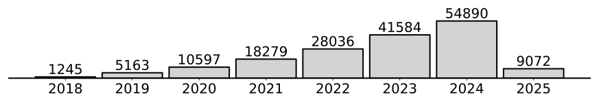
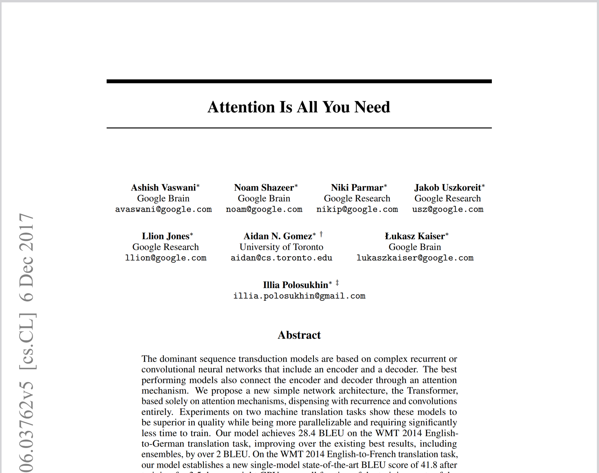
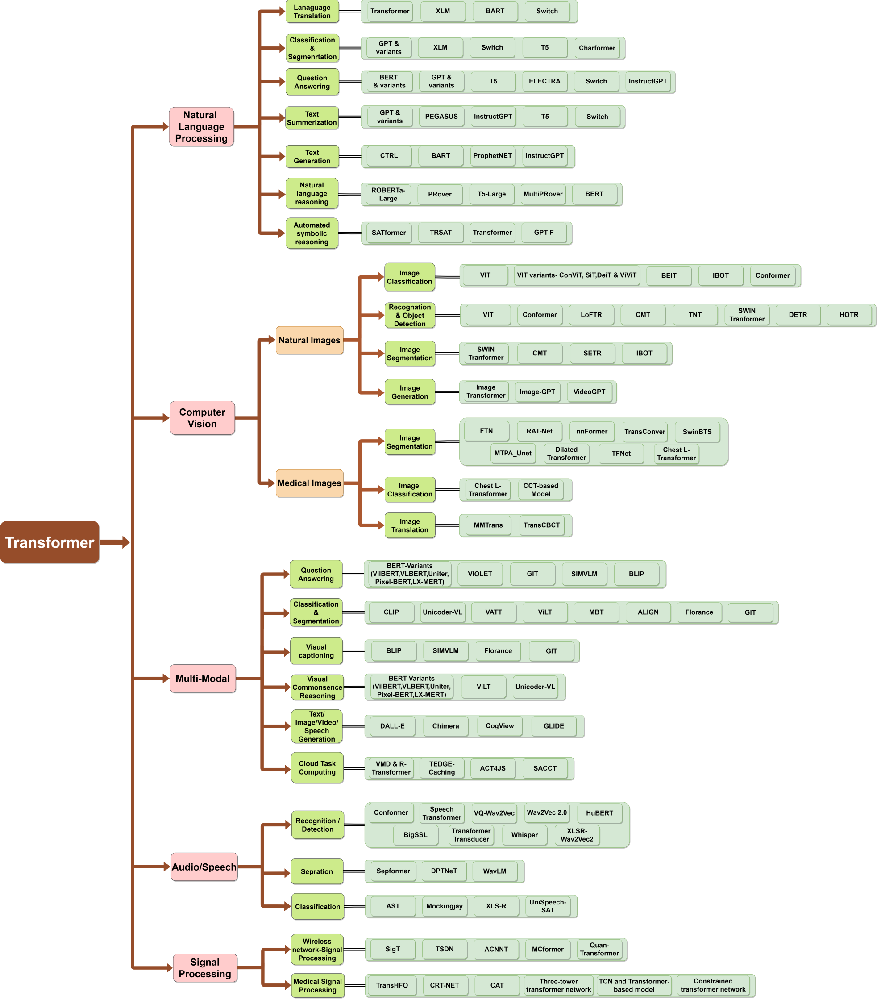
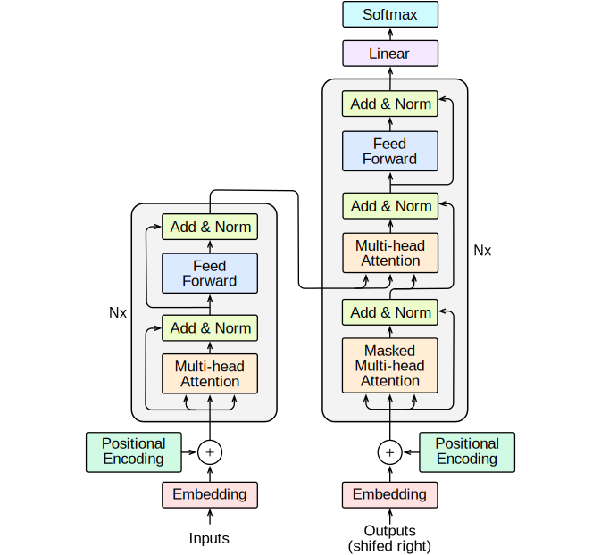
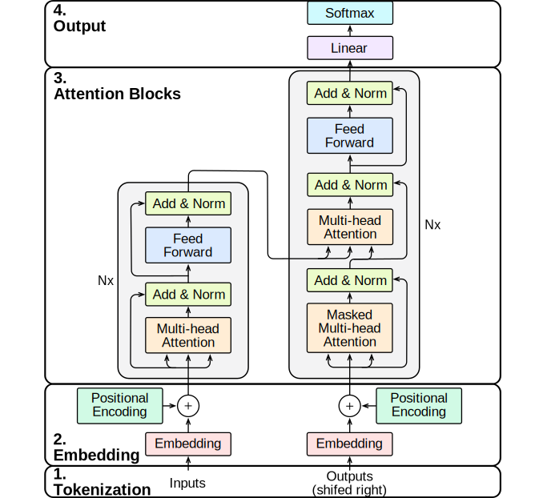

---
# You can also start simply with 'default'
theme: neversink
neversink_slug: "Attention & Transformers"
author: Ivo Verhoeven

# Export settings
exportFilename: "attention_and_transformers_2"
export:
  format: pdf
  timeout: 30000
  withClicks: true
  withToc: true

# Code block settings
lineNumbers: false

# Markup settings
colorSchema: light
aspectRatio: "16/9"
favicon: 'https://cdn.jsdelivr.net/gh/slidevjs/slidev/assets/favicon.png'

# Cover layout options
layout: intro
hideInToc: true
color: dark
---

# Attention & Transformers

[Ivo Verhoeven](mailto:i.o.verhoeven@uva.nl) | Advanced Topics in Computational Semantics

<!-- Presentation slides for developers -->

---
layout: two-cols-title
hideInToc: true
color: light
---

:: title ::

# About Me

:: left ::

<figure style="display: flex; justify-content: center;height: 100%">
  
</figure>

:: right ::

<div class="ns-c-tight">

- 2017 - 2020: BSc. Liberal Arts & Sciences

<br>

- 2020 – 2022: MSc. AI at University of Amsterdam

  - Thesis on meta-learning, morphology and NMT

  - Took ATCS in 2021

<br>

- 2022 - ???: PhD at ILLC

  - Misinformation detection and generalisation with Katia Shutova

</div>

---
layout: two-cols-title
title: "Vaswani et al. - Paper"
hideInToc: true
color: light
columns: is-6
align: l-lt-lb
---

:: title ::

# Vaswani et al.: Attention is All You Need

:: left ::

- Introduces the Transformer architecture in late 2017
  	- Google Brain/Google Research collab

<v-click>

- Paper currently has **169 248** citations

    - Or **~64 citations a day**

</v-click>

<v-click>

- Number of citations is only accelerating

<figure>
  
</figure>

</v-click>

<v-click>

- Most cited paper ever has **233 829** citations
  ```
  Lowry et al. (1951) Protein measurement with
  the folin phenol reagent.
  ```

</v-click>

:: right ::


```
Vaswani et al. (2017). Attention is all you need. Advances in
neural information processing systems, 30.
```

<figure>
  
</figure>

---
layout: two-cols-title
title: "Vaswani et al. - Effect"
hideInToc: true
color: light
columns: is-6
align: l-lt-lt
---

:: title ::

# Vaswani et al.: Attention is All You Need

:: left ::

- It's hard to think of an AI area that hasn't been affected by the Transformer
  <div class="ns-c-tight">
  <v-click>

  - **NLP:** Transformer > RNN
    - Seq-to-seq: what it was designed for
    - Classification: encoder-only transformers
    - Generation: decoder-only transformers
  </v-click>

  <v-click>

  - **CV:** ViT > CNN
  - **Multi-modal:** Transformer > different architectures
  - **Speech:** Transformer > CNN
  - **Graphs:** Transformer/Attention > GCN

  </v-click>
  </div>

:: right ::

<figure>
  
</figure>
```
Islam, et al. (2023). A Comprehensive Survey on Applications of
Transformers for Deep Learning Tasks. arXiv:2306.07303.
```

---
layout: side-title
color: dark
hideInToc: true
side: l
titlewidth: is-4
align: rm-mt
---

:: title ::

# The Transformer

:: content ::

<figure>
  
</figure>

---
hideInToc: true
layout: two-cols-title
color: light
columns: is-6
align: l-lt-lt
---

:: title ::

# Breaking the Transformer into modules

:: left ::

<div class="ns-c-tight">
<v-click>

4. Output
    - <span class="bg-teal-100 text-black p-0.5 pl-2 pr-2 m-0 rounded">Softmax</span>
    - <span class="bg-violet-100 text-black p-0.5 pl-2 pr-2 m-0 rounded">Linear</span>

</v-click>
</div>

<div class="ns-c-tight">
<v-click>

3. Attention Blocks
    - <span class="bg-orange-100 text-black p-0.5 pl-2 pr-2 m-0 rounded">Multi-head Attention</span>
    - <span class="bg-lime-100 text-black p-0.5 pl-2 pr-2 m-0 rounded">Add & Norm</span>
    - <span class="bg-blue-100 text-black p-0.5 pl-2 pr-2 m-0 rounded">Feed Forward</span>

</v-click>
</div>

<div class="ns-c-tight">
<v-click>

2. Embedding
    - <span class="bg-red-100 text-black p-0.5 pl-2 pr-2 m-0 rounded">Token Embedding</span>
    - <span class="bg-green-100 text-black p-0.5 pl-2 pr-2 m-0 rounded">Positional Encoding</span>

</v-click>
</div>

<div class="ns-c-tight">
<v-click>

1. Tokenization
    - (Not pictured)

</v-click>
</div>

:: right ::

<figure>
  
</figure>

---
layout: two-cols-title
color: light
columns: is-6
align: l-lt-lt
hideInToc: true
---

:: title ::

# Breaking the Transformer into modules

:: left ::

<div class="ns-c-tight">

4. ~~Output~~
    - <s><span class="bg-teal-100 text-black p-0.5 pl-2 pr-2 m-0 rounded">Softmax</span></s>
    - <s><span class="bg-violet-100 text-black p-0.5 pl-2 pr-2 m-0 rounded">Linear</span></s>

</div>

<div class="ns-c-tight">

3. Attention Blocks
    - <span class="bg-orange-100 text-black p-0.5 pl-2 pr-2 m-0 rounded">Multi-head Attention</span>
    - <span class="bg-lime-100 text-black p-0.5 pl-2 pr-2 m-0 rounded">Add & Norm</span>
    - <span class="bg-blue-100 text-black p-0.5 pl-2 pr-2 m-0 rounded">Feed Forward</span>

</div>

<div class="ns-c-tight">

2. Embedding
    - <s><span class="bg-red-100 text-black p-0.5 pl-2 pr-2 m-0 rounded">Token Embedding</span></s>
    - <span class="bg-green-100 text-black p-0.5 pl-2 pr-2 m-0 rounded">Positional Encoding</span>

</div>

<div class="ns-c-tight">

1. Tokenization
    - (Not pictured)

</div>

:: right ::

<figure>
  
</figure>

---
layout: two-cols-title
hideInToc: true
color: light
columns: is-6
align: l-lt-lt
---
:: title ::
# Table of Contents

:: left ::

<div class="ns-c-tight">
<Toc />
</div>

:: right ::

<figure>
  
</figure>

---
layout: section
color: dark
---

# Encoders & Decoders

Text comes in, text goes out

---
title: "The Transformer - GIF"
hideInToc: true
layout: full
color: white
---

<a href="https://3.bp.blogspot.com/-aZ3zvPiCoXM/WaiKQO7KRnI/AAAAAAAAB_8/7a1CYjp40nUg4lKpW7covGZJQAySxlg8QCLcBGAs/s640/transform20fps.gif">

</a>
```
Jakob Uszkoreit (August 31, 2017). Transformer: A Novel Neural Network Architecture for Language  Understanding.
https://research.google/blog/transformer-a-novel-neural-network-architecture-for-language-understanding/
```

---
title: "Attention Blocks"
color: dark
layout: section
columns: is-6
align: l-lt-lt
---

# Attention Blocks

What makes the Transformer what it is --- and where it came from

---
layout: default
color: light
---

## <span class="bg-orange-100 text-black p-0.5 pl-2 pr-2 m-0 rounded">Multi-head Attention</span>

$$ {1|3|all}
\begin{aligned}
\nabla \cdot \vec{E} &= \frac{\rho}{\varepsilon_0} \\
\nabla \cdot \vec{B} &= 0 \\
\nabla \times \vec{E} &= -\frac{\partial\vec{B}}{\partial t} \\
\nabla \times \vec{B} &= \mu_0\vec{J} + \mu_0\varepsilon_0\frac{\partial\vec{E}}{\partial t}
\end{aligned}
$$

---
layout: default
color: light
---

### Definition & Properties

##### <span class="bg-orange-100 text-black p-0.5 pl-2 pr-2 m-0 rounded">Multi-head Attention</span>

---
layout: default
color: light
---

### Non-Transformer Examples
##### <span class="bg-orange-100 text-black p-0.5 pl-2 pr-2 m-0 rounded">Multi-head Attention</span>

---
layout: default
color: light
---

### Attention in Transformers
##### <span class="bg-orange-100 text-black p-0.5 pl-2 pr-2 m-0 rounded">Multi-head Attention</span>

---
layout: default
color: light
---

### Multi-head Attention
##### <span class="bg-orange-100 text-black p-0.5 pl-2 pr-2 m-0 rounded">Multi-head Attention</span>

---
layout: default
color: light
---

## <span class="bg-lime-100 text-black p-0.5 pl-2 pr-2 m-0 rounded">Add & Norm</span>


---
layout: default
color: light
---

### Residual Connections
##### <span class="bg-lime-100 text-black p-0.5 pl-2 pr-2 m-0 rounded">Add & Norm</span>

---
layout: two-cols-title
color: light
columns: is-6
align: l-lt-lt
---

:: title ::

### LayerNorm
##### <span class="bg-lime-100 text-black p-0.5 pl-2 pr-2 m-0 rounded">Add & Norm</span>

::left::

These are the equations

::right::

$$
\begin{aligned}
\mathbf{X}_{l}~~=~~&\mathtt{LayerNorm}( \\
&~~\mathbf{X}_{l-1}+\texttt{SubLayer}\left(\mathbf{X}_{l-1}\right) \\
&)
\end{aligned}
$$

---
layout: default
color: light
---

## <span class="bg-blue-100 text-black p-0.5 pl-2 pr-2 m-0 rounded">Feed Forward</span>

---
layout: section
title: "Embedding"
color: dark
columns: is-6
align: l-lt-lt
---

# Embedding

---
layout: default
color: light
---

## <span class="bg-green-100 text-black p-0.5 pl-2 pr-2 m-0 rounded">Position Encoding</span>

---
layout: section
color: dark
columns: is-6
align: l-lt-lt
---

# Tokenization

---
layout: section
color: dark
columns: is-6
align: l-lt-lt
---

# Training Transformers

---
layout: "end"
hideInToc: true
---

# The End
